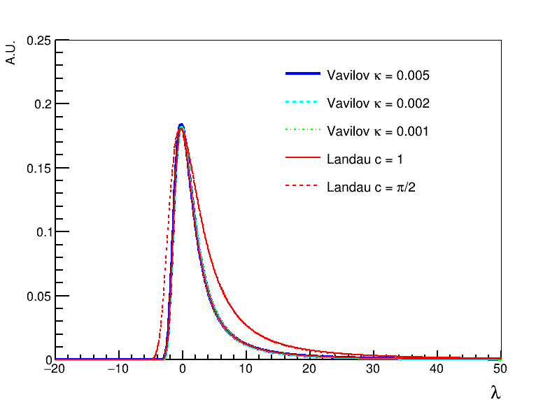

# Landau_cutoff_for_mean

Plot &lambda;<sub>max</sub> for &lambda; from -3 to 8 in the standard Landau function and fit.
The TMath::Landau and TMath::VavilovAccurate classes of the ROOT are used.

## Run
You need the ROOT package.
I am using ROOT 6.26/06.
```
root -l -b -q comparison.C
```

## Functions

### void Landau_Vavilov_comparison()

Compare Vavilov and Landau functions in the TMath class to confirm that TMath::Landau(x, 0, 1) is the standard Landau function (location parameter = 0, scale parameter = &pi;/2).

[pdf version](Vavilov_Landau_comparison.pdf)


### void landau_mean_distribution()

Plot mean of the standard Landau function as a function of &lambda;.

[pdf version](lambda_mean_distribution.pdf)


### void lambda_max_formula_comparison()

Plot &lambda;<sub>max</sub> as a function of &lambda;, where &lambda;<sub>max</sub> is cutoff value that gives the &lambda; as mean of the standard Landau function.

[pdf version](lambda_max_formula_comparison.pdf)


```
****************************************
Minimizer is Minuit / Migrad
Chi2                      =      1155.75
NDf                       =        10994
Edm                       =  7.31369e-07
NCalls                    =          782
p0                        =      0.51146   +/-   0.0039327   
p1                        =      1.19486   +/-   0.00144674  
p2                        =     0.465814   +/-   2.08633e-05 
p3                        =    0.0115374   +/-   2.81671e-06 
p4                        =      1.17165   +/-   3.87597e-05 
p5                        =     0.979242   +/-   4.94043e-06 
```
